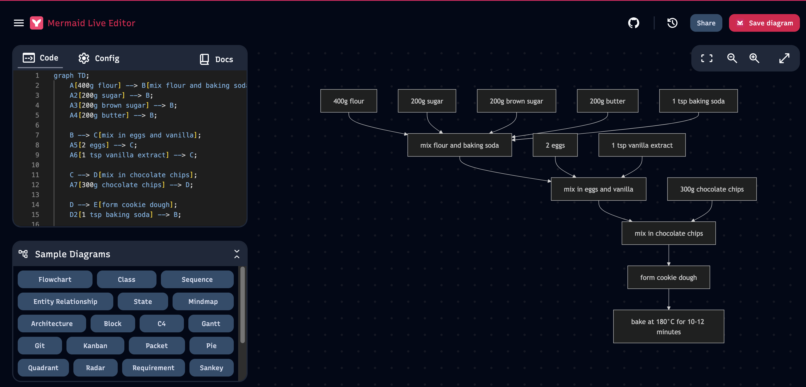

# recipe-viz

A Haskell program that calls the OpenAI API to turn a hard-coded URL into a mermaid data structure



## Setup

1. **Copy the example env file and add your key**

   ```bash
   cp .env.example .env
   ```

   Edit `.env` and set your OpenAI API key:

   ```
   OPENAI_API_KEY=sk-your-actual-key-here
   ```

   `.env` is in `.gitignore`, so it will not be committed.

2. **Build and run**

   ```bash
   cabal build
   cabal run recipe-viz
   ```

   The program loads variables from `.env` (if present) then reads `OPENAI_API_KEY` and calls the OpenAI chat completions API with the prompt to create a mermaid data structure.

## Requirements

- GHC and Cabal (e.g. from [GHCup](https://www.haskell.org/ghcup/))
- An OpenAI API key
